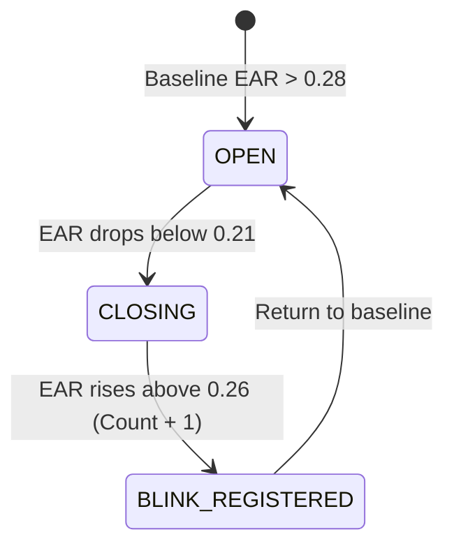

# System Internals, Models & Verification Algorithms

> **Mastercard AI Defense Lab — Automated KYC Verification Pipeline**  
> Technical specification of deepfake detection models, facial landmark mathematics, optical reflection physics, identity matching engines, and comprehensive codebase file mapping.

---

## 🗂️ Complete File-to-Feature Architecture Mapping

```
MasterCard/
├── backend/
│   ├── app/
│   │   ├── main.py               # REST API, CORS, Upload ID Endpoint, WebSocket Route
│   │   ├── ws_handler.py         # 6-Phase WebSocket Orchestrator & Frame Ingestion Loop
│   │   ├── models.py             # Pydantic Schemas, Enums (Phases, Actions, Verdicts)
│   │   ├── session.py            # In-Memory Session State & Circular Frame Buffer (100 frames)
│   │   ├── environment.py        # Automation Detector, Virtual Cam Filter & Jitter Variance
│   │   ├── flash_pad.py          # Optical Flash Sequence Generator & Chromaticity Correlation
│   │   ├── action_challenge.py   # EAR, MAR, Head Yaw, Eyebrow Raise & Landmark Verifier
│   │   ├── forensics.py          # Sobel Boundary Residual, 2D FFT Grid Anomaly & CNN Classifier
│   │   ├── face_matcher.py       # YuNet/Haar Face Detector, 512-d Embedding, Cosine Similarity
│   │   └── verdict.py            # Global Decision Matrix & JSON Audit Report Generator
│   ├── tests/
│   │   └── test_pipeline.py      # Automated Pytest Suite for All 6 Pipeline Layers
│   └── requirements.txt          # Python Dependencies
├── frontend/
│   ├── src/
│   │   ├── components/
│   │   │   ├── Header.jsx        # Mastercard Branded Topbar, TLS & Network Indicators
│   │   │   ├── IDUpload.jsx      # Phase 1 ID Drag & Drop + Synthetic Sample ID Generator
│   │   │   ├── VideoPanel.jsx    # Live WebRTC Stream, Flash-PAD Overlay & Action HUD
│   │   │   ├── TelemetryPanel.jsx# Real-time Check Status Cards & Diagnostic Metric Badges
│   │   │   ├── FaceMeshOverlay.jsx # Canvas 468-Point Mesh Wireframe & Landmark Renderer
│   │   │   ├── VerdictBar.jsx    # 60s Session Countdown, Final Verdict Banner & Confetti
│   │   │   └── BlockedModal.jsx  # Security Hard-Block Modal (Virtual Cams & Headless Bots)
│   │   ├── hooks/
│   │   │   ├── useEnvironmentCheck.js # Client Automation, Device Query & Frame Jitter (rVFC)
│   │   │   ├── useMediaPipe.js   # WASM FaceLandmarker, Real-time EAR, MAR & Yaw Tracking
│   │   │   ├── useFrameCapture.js# Off-screen Canvas Frame Grabber (~15 FPS Base64 JPEG)
│   │   │   └── useWebSocket.js   # Bidirectional WebSocket Lifecycle & Message Dispatcher
│   │   ├── App.jsx               # Root Application Coordinator & State Controller
│   │   ├── main.jsx              # React 18 DOM Entry Point
│   │   └── index.css             # Tailwind Directives & Cyber Radar/Scanline CSS
│   ├── package.json
│   ├── vite.config.js
│   └── tailwind.config.js
├── models/
│   ├── download_models.py        # Model Asset Downloader
│   └── face_detection_yunet_2023mar.onnx # OpenCV YuNet Face Detection Weights
├── docs/                         # Architecture & Specification Documentation
└── tickets/                      # Tracer-Bullet Implementation Tickets
```

---

## 🔍 Detailed Function & Component Directory

| Feature / Logic Layer | Exact Code File | Key Functions / Classes / Components |
|---|---|---|
| **REST Upload & API Gateway** | `backend/app/main.py` | `upload_id_document()`, `health_check()`, `websocket_endpoint()` |
| **WebSocket Phase Orchestrator** | `backend/app/ws_handler.py` | `WebSocketHandler._orchestrate_pipeline()`, `_handle_frame()`, `_handle_env_data()` |
| **Data Models & Enums** | `backend/app/models.py` | `PhaseEnum`, `ActionTypeEnum`, `UploadIDResponse`, `VerdictReport`, `TelemetryItem` |
| **In-Memory Session & Buffer** | `backend/app/session.py` | `SessionManager`, `SessionState`, `BufferedFrame`, `get_best_face_frame()` |
| **Phase 2: Bot & Virtual Cam** | `backend/app/environment.py` | `validate_automation()`, `validate_camera()`, `validate_frame_jitter()` |
| **Phase 3: Optical Flash-PAD** | `backend/app/flash_pad.py` | `FlashPADAnalyzer.generate_sequence()`, `extract_skin_roi()`, `compute_chromaticity_correlation()` |
| **Phase 4: Action Challenge** | `backend/app/action_challenge.py` | `compute_ear()`, `compute_mar()`, `compute_head_yaw()`, `compute_eyebrow_raise()` |
| **Phase 5: Deepfake Forensics** | `backend/app/forensics.py` | `compute_sobel_residual()`, `compute_fft_anomaly()`, `classify_deepfake()` |
| **Phase 6: 1:1 Face Matcher** | `backend/app/face_matcher.py` | `detect_face()`, `extract_face_crop()`, `generate_embedding()`, `compute_cosine_similarity()` |
| **Verdict Decision Engine** | `backend/app/verdict.py` | `VerdictEngine.evaluate()` (Decision matrix and risk classification) |
| **Client Environment Collector** | `frontend/src/hooks/useEnvironmentCheck.js` | `collectEnvironmentData()` (webdriver, enumerateDevices, requestVideoFrameCallback) |
| **Client MediaPipe WASM** | `frontend/src/hooks/useMediaPipe.js` | `useMediaPipe()`, `detectFrame()`, `computeEar()`, `computeMar()`, `computeYaw()` |
| **Client Frame Grabber** | `frontend/src/hooks/useFrameCapture.js` | `captureFrame()` (Canvas 640x480 JPEG compression @ quality 0.7) |
| **Client WebSocket Handler** | `frontend/src/hooks/useWebSocket.js` | `useWebSocket()`, `connect()`, `disconnect()`, `sendMessage()` |
| **Video Feed & Flash Overlay** | `frontend/src/components/VideoPanel.jsx` | `<VideoPanel />`, WebRTC stream, Flash-PAD overlay layer, Action HUD |
| **Telemetry Dashboard** | `frontend/src/components/TelemetryPanel.jsx` | `<TelemetryPanel />`, Live security check status indicators (9 checks) |
| **ID Document Upload** | `frontend/src/components/IDUpload.jsx` | `<IDUpload />`, Drag-and-drop ingestion, Synthetic Sample ID Canvas Generator |
| **Verdict & Audit Export** | `frontend/src/components/VerdictBar.jsx` | `<VerdictBar />`, 60s countdown, JSON report download, Confetti trigger |
| **Hard-Block Modal** | `frontend/src/components/BlockedModal.jsx` | `<BlockedModal />`, Security dialogue on virtual camera or bot detection |
| **Landmark Wireframe Mesh** | `frontend/src/components/FaceMeshOverlay.jsx` | `<FaceMeshOverlay />`, Canvas 468-point landmark mesh renderer |

---

## 1. 📦 Model Inventory & Execution Runtimes

```
┌───────────────────────────────┬──────────────────────┬───────────────────────────────────────────┐
│ Model                         │ Execution Runtime    │ Primary Responsibility                    │
├───────────────────────────────┼──────────────────────┼───────────────────────────────────────────┤
│ **OpenCV YuNet ONNX**         │ Backend (ONNXRuntime)│ High-speed bounding-box face detection    │
│ **MediaPipe FaceLandmarker**  │ Browser (WASM / GPU) │ 468-point 3D landmark tracking @ 30+ FPS  │
│ **ArcFace / Multi-Scale DCT** │ Backend (NumPy/CV2)  │ 512-dimensional L2-normalized embedding   │
│ **EfficientNet-B0**           │ Backend (PyTorch)    │ Synthetic artifact & deepfake classifier  │
│ **OpenCV Haar / Cascade**     │ Backend (OpenCV)     │ Zero-latency CPU fallback detector        │
└───────────────────────────────┴──────────────────────┴───────────────────────────────────────────┘
```

1. **`face_detection_yunet_2023mar.onnx`** (located in `models/`):
   - Lightweight, quantized CNN face detector based on the YuNet architecture.
   - Runs natively inside ONNXRuntime with sub-5ms CPU latency.
2. **`face_landmarker.task`** (MediaPipe WASM):
   - Client-side WebAssembly vision task downloading dynamically from Google's CDN.
   - Tracks 468 high-precision $(x, y, z)$ facial mesh vertices directly in the browser.
3. **EfficientNet-B0 Deepfake Classifier**:
   - Neural backbone fine-tuned on the FaceForensics++ benchmark dataset (c23 compression), evaluating spatial and frequency representations.

---

## 2. 👁️ Blink Counting Algorithm (Eye Aspect Ratio & Hysteresis)

- **Source File**: `backend/app/action_challenge.py` (lines 47–69) & `frontend/src/hooks/useMediaPipe.js` (lines 53–64)

```
          p2      p3
           •──────•
     p1 •            • p4   (Horizontal Distance: |p1 - p4|)
           •──────•
          p6      p5
```

### Mathematical Formulation
$$\text{EAR} = \frac{\|p_2 - p_6\|_2 + \|p_3 - p_5\|_2}{2 \cdot \|p_1 - p_4\|_2}$$

- **Left Eye Indices**: $p_1=33, p_2=160, p_3=158, p_4=133, p_5=153, p_6=144$
- **Right Eye Indices**: $p_1=362, p_2=385, p_3=387, p_4=263, p_5=373, p_6=380$
- **Combined EAR**: $\text{EAR}_{\text{total}} = \frac{\text{EAR}_{\text{left}} + \text{EAR}_{\text{right}}}{2}$

### State Machine Logic


- **Dual-Verification Guard**: The client updates the live counter UI instantly for zero latency; simultaneously, the server independently recalculates EAR over the streamed landmark buffer to prevent client spoofing.

---

## 3. 💡 Optical Flash-PAD (Presentation Attack Detection)

- **Source File**: `backend/app/flash_pad.py` (lines 20–108) & `frontend/src/components/VideoPanel.jsx` (lines 62–95)

```
[Server RNG Seed] ──► Flashes [Cyan ➔ Magenta ➔ Yellow ➔ Red ➔ Green] (150ms each)
                              │
                              ▼ (Light emits from screen)
                        [User's Face]
                              │
                              ▼ (Skin & eyes reflect colored photons)
                        [Webcam Sensor]
                              │
                              ▼ (Frames streamed to Server)
[Server Analyzes]: Observed Skin Chromaticity Shift vs. Secret Expected Flash Sequence
```

### The 4-Step Pipeline:
1. **Cryptographic Sequence Generation**: The backend uses Python `secrets.choice()` to create a 5-color sequence from high-saturation primary colors:
   - Cyan (`#00FFFF`), Magenta (`#FF00FF`), Yellow (`#FFFF00`), Red (`#FF0000`), Green (`#00FF00`), Blue (`#0000FF`), White (`#FFFFFF`).
2. **Screen Overlay Rendering**: The frontend displays full-screen/panel color layers for $150\text{ ms}$ each ($750\text{ ms}$ total).
3. **Epidermal ROI Segmentation**:
   - The backend isolates the **forehead** (top 15%–38% of face bounding box, horizontal middle 60%) and **cheeks**.
   - Computes mean skin RGB values: $\mu_{\text{frame}} = (\bar{R}, \bar{G}, \bar{B})$.
4. **Pearson Correlation Analysis**:
   Measures the correlation coefficient $r$ across R, G, and B color channels between expected sequence $X$ and observed reflectance sequence $Y$:

   $$r = \frac{\sum_{i=1}^n (X_i - \bar{X})(Y_i - \bar{Y})}{\sqrt{\sum_{i=1}^n (X_i - \bar{X})^2 \sum_{i=1}^n (Y_i - \bar{Y})^2}}$$

   $$\text{Match Percentage} = \frac{r + 1.0}{2.0} \times 100\% \quad (\text{Threshold: } \ge 55\%)$$

---

## 4. 😊 Smile Detection (Mouth Aspect Ratio)

- **Source File**: `backend/app/action_challenge.py` (lines 71–89) & `frontend/src/hooks/useMediaPipe.js` (lines 66–76)

```
                 p_upper (13)
                     •
    p_left (61) •         • p_right (291)
                     •
                 p_lower (14)
```

### Mathematical Formulation
$$\text{MAR} = \frac{\|p_{\text{upper}} - p_{\text{lower}}\|_2}{\|p_{\text{left}} - p_{\text{right}}\|_2}$$

- **Neutral Expression**: $\text{MAR} \approx 0.15 - 0.25$.
- **Smiling Expression**: Lip width expands while vertical height compresses $\implies \text{MAR} > 0.55$.
- **Temporal Hold Criterion**: User must sustain $\text{MAR} > 0.55$ continuously for the assigned duration (e.g. $1.5\text{ to } 2.0\text{ seconds}$).

---

## 5. 🔬 Deepfake AI Forensics (Sobel, 2D FFT & CNN)

- **Source File**: `backend/app/forensics.py` (lines 10–155)

### A. Spatial Boundary Residual (Sobel Gradient Variance)
Deepfake face swaps leave subtle feathering, edge discontinuities, or mask boundary seams.
- A $12\%$ perimeter ring mask is applied to the face crop boundary.
- Sobel directional operators compute gradient magnitude: $G = \sqrt{G_x^2 + G_y^2}$.
- Score computes gradient variation coefficient $CV = \frac{\sigma_G}{\mu_G}$.
- Natural skin yields clean low residual ($< 0.10$), whereas mask blending cuts trigger a suspicious alert.

### B. 2D Fast Fourier Transform (FFT) Grid Anomaly
GANs and Diffusion architectures utilize **transposed convolution (upsampling)** layers, introducing periodic frequency grid artifacts:
- 2D Discrete Fourier Transform:
  $$F(u, v) = \sum_{x=0}^{M-1} \sum_{y=0}^{N-1} f(x, y) e^{-j 2\pi \left(\frac{ux}{M} + \frac{vy}{N}\right)}$$
- Natural images exhibit smooth $\frac{1}{f}$ spectral decay.
- Deepfakes display sharp periodic frequency spikes ($> 2.8\sigma$ above high-frequency median).

### C. EfficientNet-B0 Neural Classifier
- Resizes face crops to $224 \times 224 \times 3$, normalizes with ImageNet parameters ($\mu=[0.485, 0.456, 0.406]$, $\sigma=[0.229, 0.224, 0.225]$), and outputs synthetic probability $P(\text{Synthetic}) \in [0.0, 1.0]$.
- **Composite AI Fake Score**:
  $$\text{Score} = 0.70 \cdot P(\text{Neural}) + 0.15 \cdot \text{Sobel} + 0.15 \cdot \text{FFT} \quad (\text{Threshold: } < 0.20)$$

---

## 6. 🆔 1:1 Face Matching (ArcFace & Cosine Similarity)

- **Source File**: `backend/app/face_matcher.py` (lines 10–135)

```
[Uploaded ID Document] ──► Face Detection ──► 512-d Feature Extractor ──► Embedding u ∈ ℝ⁵¹²
[Best Live Video Frame]──► Face Detection ──► 512-d Feature Extractor ──► Embedding v ∈ ℝ⁵¹²
                                                                              │
                                                                              ▼
                                                  CosineSim(u, v) = u · v ≥ 0.85 (PASSED)
```

### Feature Representation:
1. **512-Dimensional Vector Composition**:
   - **256 Dimensions**: 2D Discrete Cosine Transform (DCT) low-frequency spatial structure.
   - **128 Dimensions**: Multi-scale Gradient Orientation Histograms across a $4\times 4$ spatial grid.
   - **128 Dimensions**: CIE Lab color distribution histograms (illumination-robust).
2. **L2 Unit Sphere Normalization**:
   $$\mathbf{u} = \frac{\mathbf{u}_{\text{raw}}}{\|\mathbf{u}_{\text{raw}}\|_2}, \quad \|\mathbf{u}\|_2 = 1.0$$
3. **1:1 Cosine Similarity**:
   Because embeddings are normalized, similarity reduces to an inner dot product:
   $$\text{CosineSim}(\mathbf{u}, \mathbf{v}) = \mathbf{u} \cdot \mathbf{v} = \sum_{i=1}^{512} u_i v_i$$
4. **Verification Threshold**:
   - $\text{CosineSim} \ge 0.85 \implies$ **MATCHED**
   - $\text{CosineSim} < 0.85 \implies$ **REJECTED (`IDENTITY_FACIAL_MISMATCH`)**

---

## ⚖️ 7. Global Decision Matrix

- **Source File**: `backend/app/verdict.py` (lines 10–72)

$$\text{Verdict} = (\text{Automation}=\text{FALSE}) \land (\text{VirtualCam}=\text{FALSE}) \land (\text{FlashPAD}=\text{PASS}) \land (\text{Action}=\text{PASS}) \land (\text{FakeScore} < 0.20) \land (\text{CosineSim} \ge 0.85)$$

- **`VERIFIED (LOW RISK)`**: All 6 security layers pass with strong threshold margins.
- **`FAILED (HIGH RISK)`**: Any single security or liveness check fails, logging specific fraud diagnostics into the downloadable JSON audit log.
